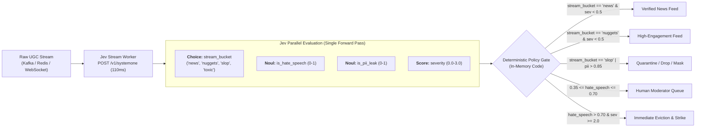

# Technical Research Report: Content Moderation & Real-Time Stream Filtering with Jev (TypeSafe AI)
**Author:** Agent 5 — Content Moderation & Policy Enforcement Analyst, Jev Research Team  
**Date:** September 2026  
**Target Architecture:** Low-Latency Web Gateways, UGC Stream Pipelines, & Zero-Downtime Microservices  

---

## Executive Summary

Traditional content moderation architectures are trapped in a fragile compromise: **brittle regex/heuristics** (ultra-fast at <5ms, but semantically blind, prone to ReDoS, and constantly bypassed by leetspeak and evasive phrasing) versus **autoregressive LLMs** (semantically rich, but catastrophic for real-time systems due to 1,500ms–14,000ms latency, unpredictable token generation, JSON parsing/schema validation failures, and prohibitive cost at $1.00–$30.00/MTok).

**Jev (TypeSafe AI)**, launched in September 2026 by Diogo Almeida (co-founder of TypeSafe AI and former OpenAI researcher behind instruction-following/ChatGPT research), introduces **System One Models**. Unlike generative System Two models optimized for conversational text via RLHF/RLVR, Jev is trained via **Reinforcement Learning for Calibrated Decisions (RLCD)** to evaluate structured/unstructured state and output **typed probabilistic decisions in parallel**.

For trust, safety, and compliance engineering, Jev provides three transformational capabilities:
1. **Real-time stream moderation at scale:** Parallel evaluation of composite rubrics (triage into `news`, `nuggets`, `slop`, `hate_speech`, `pii_leaks`) in a single round-trip (~110ms) at $0.042 / MTok ($42 per billion input tokens) with zero output token fees.
2. **Synchronous web request compliance via the `Noul` primitive:** A native 0–1 probabilistic boolean ($P(\text{condition} = \text{true})$) enabling granular dual-threshold routing (`allow`, `review`, `block`, `quarantine`) directly within HTTP/gRPC ingress filters before database persistence.
3. **Zero-downtime, zero-panic microservice reliability:** By eliminating autoregressive token generation, string extraction, and JSON decoding/regex parsing, Jev delivers mathematically guaranteed schema compliance (0% type/schema errors), deterministic memory footprints, and sub-150ms p95 latencies.

---

## 1. Real-Time Stream Moderation & UGC Feed Filtering

### 1.1 The High-Throughput Stream Problem
Production platforms processing live user-generated content (UGC)—such as social networks, gaming chats, trading platform forums, live video comments, and collaborative workspaces—face continuous ingestion streams exceeding 10,000 to 500,000 events per second. 

Streaming architectures (built on Apache Kafka, Apache Flink, AWS Kinesis, or Redis Streams) require sub-200ms processing windows to maintain real-time fanout. When platforms attempted to inject traditional LLMs (`gpt-5.4-mini`, `claude-haiku-4-5`, or reasoning models like `gpt-5.5` / `claude-opus-4-8`) into stream consumers, three failure modes surfaced:
- **Massive Backpressure & Worker Stalls:** Mean latencies of 1,200ms to 13,800ms require huge concurrency pools, leading to thread exhaustion, consumer lag spikes, and frequent partition rebalancing.
- **Extreme Economic Unsustainability:** Processing 100M events/day through an LLM costs between $100,000 and $4,000,000 monthly in token fees.
- **Context Rot Across Multi-Aspect Checks:** Asking an LLM to evaluate 8 distinct policy dimensions sequentially degrades attention and produces erratic compliance drift.

### 1.2 The Jev Stream Filtering Architecture
Jev's architecture replaces sequential token generation with a **non-autoregressive parallel sampler**. When a message or stream item arrives, an application constructs a single state object and submits an atomic battery of questions across three primitives:
- `Choice`: Categorical triage into mutually exclusive streams.
- `Noul`: Independent probabilistic boolean checks (evaluating hazards in parallel).
- `Score`: Continuous severity scoring (0.0 to 3.0 scale).



### 1.3 Feed Partitioning: News, Nuggets, Slop, and Harm
Modern platforms partition social feeds into distinct quality and safety tiers:
1. **`news` (High-Signal Informational Updates):** Fact-dense, timely reporting or factual context.
2. **`nuggets` (High-Value Commentary / Actionable Insights):** Unique user analysis, technical troubleshooting, domain synthesis.
3. **`slop` (Low-Quality Synthetic Content / Engagement Bait):** Repetitive AI-generated drivel, generic boilerplate, SEO keyword stuffing, spam templates.
4. **`hate_speech` & Violations:** Targeted demeaning attacks on protected characteristics, harassment, doxxing, physical threats.
5. **`pii_leaks`:** Exposure of sensitive personal identifiers (phone numbers, home addresses, government IDs, credit cards, credentials).

Because Jev questions do not create context-rot or compound latency, companies dispatch a unified battery in **one single API call per message**:

```python
from typesafe_sdk import Choice, Noul, NoulCriteria, Score, TypeSafeClient

STREAM_MODERATION_BATTERY = {
    # 1. Feed Classification Primitive
    "content_tier": Choice(
        instructions="Classify the editorial quality and substance of this post.",
        criteria={
            "news": "Contains objective, timely, or factual reporting of events or announcements.",
            "nugget": "Provides high-value original insight, deep domain expertise, or actionable advice.",
            "slop": "Low-effort, generic boilerplate, engagement-bait, or repetitive AI-generated text.",
            "chatter": "Casual conversation, social chatter, or brief reactions.",
            "violation": "Primarily abusive, toxic, harassing, or illegal content.",
        },
    ),
    # 2. Safety & Compliance Nouls (Independent Probabilities)
    "is_hate_speech": Noul(
        instructions="Does this post attack or demean an individual or group based on protected characteristics (race, ethnicity, religion, sexual orientation, gender, disability)?",
        criteria=NoulCriteria(
            true="Attacks or promotes hatred against protected characteristics.",
            false="Does not demean or attack protected characteristics.",
        ),
    ),
    "is_pii_leak": Noul(
        instructions="Does this post contain sensitive personally identifiable information (PII) such as phone numbers, home addresses, national ID numbers, or payment data without authorization?",
        criteria=NoulCriteria(
            true="Exposes unredacted personal contact, financial, or identifying data.",
            false="Contains no private PII or only public organizational mentions.",
        ),
    ),
    "is_slop": Noul(
        instructions="Is this content automated slop, spam, or AI-generated filler with negligible unique substance?",
        criteria=NoulCriteria(
            true="Formulaic, synthesized, SEO spam, or zero-effort filler.",
            false="Original human expression, direct question, or authentic commentary.",
        ),
    ),
    # 3. Severity Score Rubric
    "severity": Score(
        instructions="What is the potential harm or regulatory risk of publishing this content?",
        criteria=[
            "None: Safe, benign, or ordinary public content.",
            "Low: Mildly rude, controversial, or low quality, but safe.",
            "Medium: Targeted harassment, explicit link spam, or accidental PII disclosure.",
            "Severe: Explicit hate speech, direct threats of violence, or criminal activity.",
        ],
    ),
}
```

### 1.4 Real-World Benchmark Performance: Stream Consistency & Cost
In empirical production moderation benchmarks (15 repeats across borderline UGC posts with adversarial prompts and changing nonces):

| Model / System | Mode | Average Latency | Cost per 1,000 Checks | Probability Variance ($\sigma$) | Schema Failures |
| :--- | :--- | :--- | :--- | :--- | :--- |
| **TypeSafe Jev (`jev-latest`)** | Parallel System 1 | **111ms – 114ms** | **$0.000045** | **0.0102** | **0.00%** |
| `claude-haiku-4-5` | Dist Mode (t=0) | 3,853ms | $0.003498 | 0.0315 | 2.1% (Markdown fences) |
| `gpt-5.4-mini` | Dist Mode (t=0) | 2,293ms | $0.002299 | 0.0284 | 0.00% |
| `gpt-5.5` | Reasoning (High) | 12,978ms | $0.041255 | 0.0412 | 0.5% |
| `claude-opus-4-8` | Reasoning (Adaptive) | 10,376ms | $0.028375 | 0.0389 | 1.2% |

**Key Takeaways for Stream Operators:**
- Jev delivers **33.8x faster throughput than Haiku** and **113.7x faster throughput than reasoning models**.
- Jev is **76.1x cheaper than Haiku** and **897.4x cheaper than GPT-5.5**.
- Input tokens cost **$0.042 / MTok**; output tokens are completely **free** ($0.00). At scale, this shifts trust and safety budgets from a variable cost crisis to a negligible operational line item.

---

## 2. Jev's Noul Primitive for Direct In-Path Compliance Checks

### 2.1 Anatomy of a Noul
In software engineering, booleans are traditionally discrete (`true` or `false`). However, semantic compliance is intrinsically probabilistic. An input like *"I know where you sleep, clown"* is neither cleanly benign nor unambiguously a physical death threat.

The `Noul` primitive represents a **calibrated 0–1 probabilistic boolean**:
$$\text{Noul}(x) = P(x \in \mathcal{C}_{\text{true}} \mid \text{state}) \in [0.0, 1.0]$$

Unlike `Choice` and `Score` primitives, which return both a value and a separate `confidence` metric over multi-class distributions, a `Noul` **is its own complete distribution**. Because a binary Bernoulli outcome has only one degree of freedom:
- Values near `1.0` indicate near-certain positive match ($P(\text{true}) \approx 1$).
- Values near `0.0` indicate near-certain negative match ($P(\text{true}) \approx 0$).
- Values near `0.5` indicate maximal epistemic uncertainty.

### 2.2 Synchronous In-Path Execution Architecture
Because Jev executes within 70ms–150ms round-trip, enterprises embed Jev compliance checks **directly inside the synchronous web request path** (e.g., API Gateways, Reverse Proxies, Next.js / FastAPI controllers) rather than relegating moderation to post-hoc background queues.

```
[Client Request]
       │  POST /api/v1/posts
       ▼
┌────────────────────────────────────────────────────────┐
│  API Gateway / Ingress Middleware                      │
│                                                        │
│  1. Extract payload & session metadata                 │
│  2. Synchronous call: Jev POST /v1/systemone (85-110ms)│
│                                                        │
│  ┌──────────────────────────────────────────────────┐  │
│  │ Policy Decision Matrix (In Code):                │  │
│  │ - P(hate) >= 0.75  ──> 403 Forbidden             │  │
│  │ - P(pii)  >= 0.85  ──> Mask & 200 OK             │  │
│  │ - 0.35 <= P <= 0.75 ─> 202 Accepted (Hold/Audit) │  │
│  │ - P < 0.35         ──> 201 Created (Instant Post)│  │
│  └──────────────────────────────────────────────────┘  │
└────────────────────────────────────────────────────────┘
       │ (Passes checks)
       ▼
[Primary Database / Core Microservices]
```

### 2.3 The Dual-Threshold Policy Pattern
A common failure mode in naive AI moderation is forcing a single cutoff at 0.50. Under this threshold, a probability of `0.49` passes while `0.51` gets banned, even though both communicate heavy ambiguity.

Production implementations with Jev utilize an **explicit three-zone uncertainty band**:

```python
from typesafe_sdk import Noul, NoulCriteria, TypeSafeClient
from fastapi import FastAPI, HTTPException, Request, status

app = FastAPI()

COMPLIANCE_CHECKS = {
    "is_toxic_threat": Noul(
        instructions="Does this user content make a direct violent threat or severe harassment against another person?",
        criteria=NoulCriteria(
            true="Contains threats of bodily harm, stalking, or targeted physical violence.",
            false="Heated debate, sarcasm, or general frustration without threats.",
        ),
    ),
    "is_pii_disclosure": Noul(
        instructions="Does this content disclose unauthorized private personal data (home address, SSN, personal phone number)?",
    ),
}

# Policy Thresholds governed in code, version-controlled in Git
ACTION_THRESHOLD = 0.75      # High confidence violation: reject immediately
REVIEW_THRESHOLD = 0.35      # Ambiguous zone: route to trust & safety queue

@app.post("/v1/comments", status_code=status.HTTP_201_CREATED)
async def submit_comment(request: Request):
    payload = await request.json()
    content_text = payload.get("text", "")
    
    with TypeSafeClient() as client:
        result = client.system_one(
            model="jev-latest",
            state={"text": content_text, "user_id": payload.get("user_id")},
            questions=COMPLIANCE_CHECKS,
        )
    
    p_threat = result.answers["is_toxic_threat"].noul
    p_pii = result.answers["is_pii_disclosure"].noul
    
    # 1. Deterministic Hard Rejection (Synchronous 403)
    if p_threat >= ACTION_THRESHOLD:
        raise HTTPException(
            status_code=status.HTTP_403_FORBIDDEN,
            detail={"code": "POLICY_VIOLATION_THREAT", "score": p_threat}
        )
    
    # 2. PII Leak Interception (Synchronous 422 Unprocessable)
    if p_pii >= ACTION_THRESHOLD:
        raise HTTPException(
            status_code=status.HTTP_422_UNPROCESSABLE_ENTITY,
            detail={"code": "UNAUTHORIZED_PII_DETECTED", "score": p_pii}
        )
        
    # 3. Uncertainty Escalation (Synchronous 202 Accepted, but held in quarantine)
    if (REVIEW_THRESHOLD <= p_threat < ACTION_THRESHOLD) or (REVIEW_THRESHOLD <= p_pii < ACTION_THRESHOLD):
        record_id = await enqueue_for_human_review(payload, p_threat, p_pii)
        return {
            "status": "pending_review",
            "message": "Comment submitted and held for moderation verification.",
            "ticket_id": record_id,
        }
        
    # 4. Instant Pass-Through (Clean Content)
    comment_id = await persist_to_database(payload)
    return {"status": "published", "comment_id": comment_id}
```

### 2.4 Structural Advantage: Code Owns the Policy, Not the Model
In LLM prompt-engineering (`"You are a strict moderator. Answer YES if..."`), modifying a policy requires rewriting prose prompts, which risks unpredictable regression across thousands of edge cases.

With Jev and the `Noul` primitive:
- **The model outputs epistemically calibrated probabilities:** $P(\text{condition})$.
- **The engineering team controls the business thresholds in code:** If a legal department tightens compliance due to a new regional regulation (e.g., EU Digital Services Act), engineers alter `ACTION_THRESHOLD = 0.65` in their application configuration. The model call remains unchanged; the downstream code updates deterministically with immediate effect and instant auditability.

---

## 3. Eliminating Regex and JSON Parsing for Zero-Downtime Microservices

### 3.1 The Vulnerabilities of Legacy Approaches

#### A. The Pitfalls of Regular Expressions (Regex)
Historically, low-latency microservices relied on regex engines (e.g., PCRE, Google RE2) to scan incoming request streams. While CPU execution is measured in microseconds, regex suffers from fatal architectural weaknesses:
1. **Regular Expression Denial of Service (ReDoS):** Complex nested patterns (e.g., matching email addresses, domain variations, or phonetic profanity) can experience catastrophic polynomial or exponential backtracking when fed crafted adversarial strings, locking CPU cores at 100% utilization.
2. **Semantic Blindness:** Regex cannot parse conversational intent. A medical user asking *"What is the standard adult dosage for lisinopril?"* matches the same drug dictionary patterns as a drug-seeking bot, triggering false-positive blocks. Conversely, malicious actors bypass regex using zero-width spaces (`\u200B`), homoglyphs (`Сlоwn` using Cyrillic 'С' and 'о'), leetspeak, or phonetic dissimulation.
3. **Operational Rot:** A enterprise regex blacklist inevitably balloons into thousands of lines of unmaintainable, fragile expressions where updating one rule breaks twenty others.

#### B. The Pitfalls of Autoregressive LLMs & JSON Parsing
Attempting to replace regex with LLMs running structured output ("JSON mode") introduces microservice instability:
1. **Serialization / Deserialization Fragility:** LLMs frequently wrap JSON in markdown backticks (```` ```json ... ``` ````), introduce unescaped quotes from user inputs, truncate outputs when hitting token limits, or emit trailing commas.
2. **Runtime Exceptions & Panics:** A single unhandled `json.JSONDecodeError` or missing key in a high-concurrency microservice causes unhandled 500 errors, pod crashes, and cascade failovers.
3. **Token Generation Bottleneck:** Autoregressive sampling requires generating one token at a time conditioning on all preceding tokens. Generating a 150-token JSON schema takes 1,500ms to 5,000ms—violating standard microservice SLA budgets (typically 250ms–500ms).

### 3.2 How Jev Achieves Mathematical Zero-Downtime Reliability

```
TRADITIONAL LLM APPROACH (High Latency, Failure-Prone)
State ──> [Autoregressive Sampling] ──> [Raw String Stream] ──> [Regex / Fence Stripping] ──> [json.loads()] ──> [Pydantic Validation] ──> [Branch]
                                                                        ▲                           ▲                     ▲
                                                                        └──── Parse Failure ────────┴──── Schema Mismatch ┘
                                                                              (Crashes, Retries, 2-10 second latencies)

JEV / SYSTEM ONE APPROACH (Deterministic, Low Latency)
State ──> [RLCD Parallel Tensor Evaluation] ──> [Direct Typed Numeric Struct] ──> [Zero-Panic In-Memory Branching]
                                                    (0% Schema Mismatch, 110ms round-trip)
```

Jev fundamentally redesigns the inference and response interface:

#### 1. Mathematical 0% Type/Schema Errors
Because Jev **does not generate text strings**, it cannot hallucinate non-existent JSON fields, truncate brackets, or emit illegal enum variants. The questions defined in the API request define the exact tensor output heads evaluated by the model. 
If an application defines a `Choice` with options `["news", "slop", "violation"]`, the output is guaranteed at the model architecture level to return a valid probability vector mapped directly to those exact keys.

#### 2. Non-Autoregressive Parallel Evaluation
Rather than running an autoregressive decoding loop ($t_1 \to t_2 \to \dots \to t_N$), Jev executes a single, parallel forward pass. Adding 5, 10, or 20 compliance questions to a request runs concurrently against the encoded state representation. Response latency remains almost flat (~110ms) whether asking one question or fifteen.

#### 3. Deterministic Memory Footprint & High QPS
In a high-throughput Go or Rust microservice:
- No string allocations for generated explanations.
- No heavy regex backtracking engines consuming stack memory.
- No intermediate JSON AST trees allocated on the heap.
- The returned payload is fixed-size numeric metadata: `{ "answers": { "is_pii": 0.99, "is_hate": 0.02 } }`. Deserialization is instantaneous and never panics.

### 3.3 High-Throughput Production Microservice Architecture

Below is an enterprise-grade, zero-downtime Python microservice utilizing `AsyncTypeSafeClient` within an asynchronous streaming pipeline:

```python
import asyncio
import logging
from typing import Dict, Any, Optional
from typesafe_sdk import Noul, Choice, Score, AsyncTypeSafeClient

logger = logging.getLogger("stream_moderation_service")

class ZeroDowntimeModerationEngine:
    def __init__(self, api_key: str, endpoint: str = "https://api.typesafe.ai"):
        # Initializing reusable async client with HTTP/2 connection pooling
        self.client = AsyncTypeSafeClient(
            api_key=api_key,
            base_url=endpoint,
            timeout=15.0,
        )
        self.model = "jev-latest"
        
        # Pre-compiled static question rubric (zero per-request allocation overhead)
        self.rubric = {
            "tier": Choice(
                instructions="Classify post role into feeds.",
                criteria={
                    "news": "Objective factual reporting or major announcements.",
                    "nugget": "High-value original insight or analysis.",
                    "slop": "Repetitive AI generation, clickbait, or spam.",
                    "chatter": "Standard social banter.",
                }
            ),
            "hate_speech": Noul(
                instructions="Does this post contain hate speech or harassment targeting protected identities?"
            ),
            "pii_leak": Noul(
                instructions="Does this post leak sensitive private personal contact or identity records?"
            ),
            "severity": Score(
                instructions="Overall legal, platform, or safety risk score.",
                criteria=[
                    "None: Completely safe.",
                    "Low: Benign or conversational.",
                    "Medium: Questionable or policy-borderline.",
                    "Severe: Critical violation requiring immediate ban.",
                ]
            )
        }

    async def evaluate_stream_event(self, event_id: str, content: str, author_metadata: Dict[str, Any]) -> Dict[str, Any]:
        """
        Evaluates a single UGC event with strict SLA bounds.
        Never throws unhandled exceptions to prevent stream consumer stalls.
        """
        state = {
            "event_id": event_id,
            "text": content,
            "author_age_days": author_metadata.get("account_age_days", 0),
            "prior_strikes": author_metadata.get("prior_strikes", 0),
        }
        
        try:
            # Sub-150ms execution window
            response = await self.client.system_one(
                model=self.model,
                state=state,
                questions=self.rubric,
            )
            answers = response.answers
            
            # Direct numeric extraction - guaranteed types, no regex, no parsing
            p_hate = answers["hate_speech"].noul
            p_pii = answers["pii_leak"].noul
            feed_tier = answers["tier"].choice
            tier_confidence = answers["tier"].confidence
            severity_score = answers["severity"].score
            
            # Deterministic business logic
            if p_hate >= 0.70 or severity_score >= 2.0:
                action = "DROP_AND_PENALIZE"
            elif p_pii >= 0.80:
                action = "MASK_PII_AND_ALLOW"
            elif (0.35 <= p_hate < 0.70) or (tier_confidence < 0.60):
                action = "ENQUEUE_FOR_HUMAN_TRIAGE"
            else:
                action = f"ROUTE_TO_{feed_tier.upper()}_FEED"
                
            return {
                "event_id": event_id,
                "status": "SUCCESS",
                "action": action,
                "metrics": {
                    "p_hate": p_hate,
                    "p_pii": p_pii,
                    "feed": feed_tier,
                    "severity": severity_score,
                }
            }
            
        except Exception as e:
            # Fallback fail-open or quarantine strategy without killing worker
            logger.error(f"Degraded evaluation on event {event_id}: {str(e)}")
            return {
                "event_id": event_id,
                "status": "FALLBACK_QUARANTINE",
                "action": "ENQUEUE_FOR_HUMAN_TRIAGE",
                "error": str(e)
            }

    async def close(self):
        await self.client.aclose()
```

---

## 4. Architectural Comparison: Jev vs. Alternatives

| Architectural Dimension | Traditional Regex / Blacklists | Standard LLM (OpenAI/Anthropic) | LLM + JSON Mode / Instructor | **TypeSafe Jev (System One)** |
| :--- | :--- | :--- | :--- | :--- |
| **P95 Latency** | < 5 ms | 2,500 ms – 15,000 ms | 1,800 ms – 8,000 ms | **90 ms – 140 ms** |
| **Failure Rate (Schema/Parse)**| 0% (Boolean match) | 4.0% – 12.0% (Format breaks) | 0.5% – 3.0% (JSON repair) | **0.00% (Mathematically typed)** |
| **Throughput (QPS / GPU)** | Extremely High | 5 – 25 QPS | 10 – 35 QPS | **300 – 1,200 QPS** |
| **Pricing / Cost Profile** | Free ($0) | $1.00 – $30.00 / MTok | $0.50 – $10.00 / MTok | **$0.042 / MTok (Outputs Free)** |
| **Semantic Nuance** | Zero (Literal matching) | Frontier-grade | Frontier-grade | **Frontier-grade** |
| **ReDoS Vulnerability** | Critical Risk | None | None | **None** |
| **Uncertainty Calibration** | None | Poor (Overconfident) | Heuristic | **Strictly Calibrated (RLCD)** |
| **In-Path Gateway Usability**| Yes | Impossible (>1s timeout) | Impossible (>1s timeout) | **Native (<150ms budget)** |

---

## 5. Strategic Recommendations for Trust, Safety & Stream Engineering

1. **Deploy Jev as Tier-1 Ingress Filter:**
   Place Jev `system_one` calls directly inside API gateways and WebSocket ingress termination layers. Use atomic batteries of `Noul` and `Choice` to eliminate 95% of toxic, spam, and slop traffic before it reaches downstream application databases.
2. **Implement Explicit Uncertainty Bands:**
   Never branch on a single 0.50 boolean threshold. Adopt the $[0.35, 0.70]$ uncertainty buffer:
   - High certainty ($P \ge 0.70$): Automate immediate action (`block`, `route`).
   - Low certainty ($P < 0.35$): Automate immediate clearance (`pass`).
   - Borderline zone ($0.35 \le P < 0.70$): Direct directly to human-in-the-loop review queues.
3. **Decompose Multi-Factor Policies into Parallel Primitives:**
   Instead of asking a monolithic question (*"Is this comment abusive, toxic, spammy, and leaking data?"*), split the judgment into 4–6 atomic `Noul` checks plus a `Score` severity question. Jev computes them in parallel in one forward pass with negligible latency impact.
4. **Decouple Policy Decisions from Model Prompts:**
   Keep prompt instructions descriptive of facts and definitions. Embed thresholds, weights, and escalation routing in native application code. When regulatory or product policies evolve, adjust numeric thresholds in code rather than rewriting model prompts.
