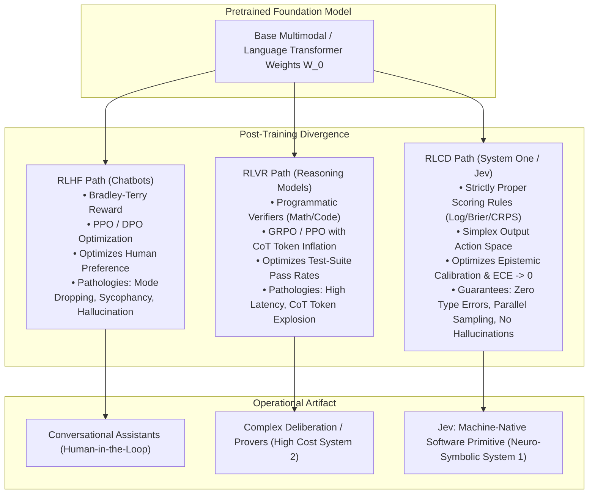
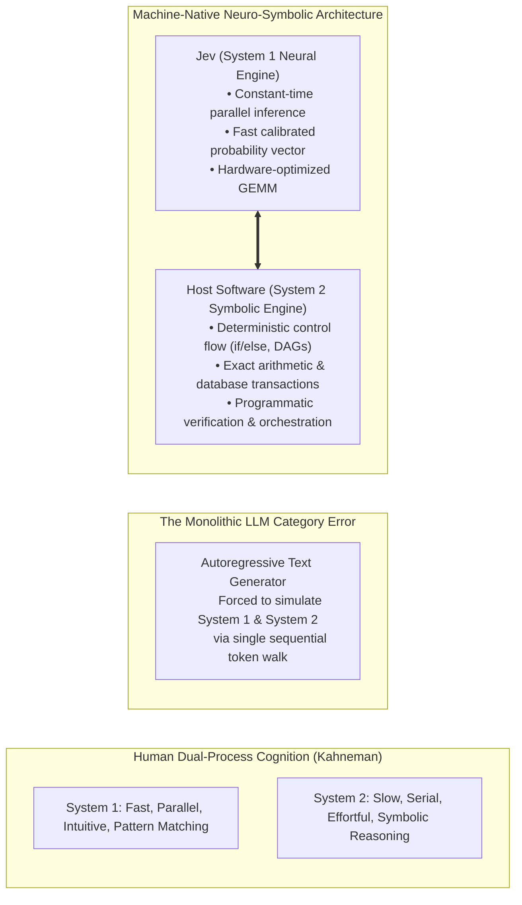
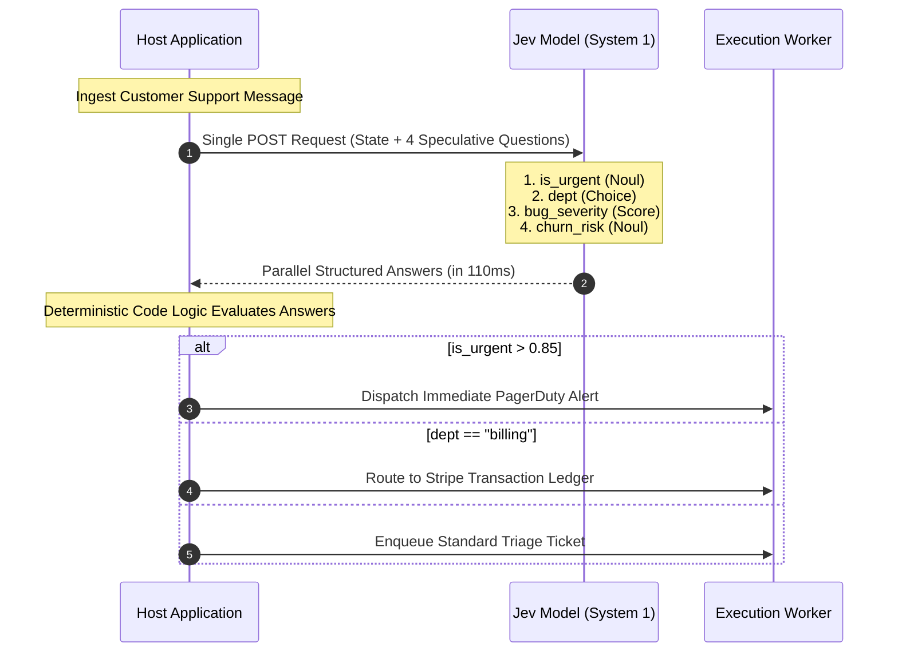

# The Scientific Foundation of Jev: Reinforcement Learning for Calibrated Decisions (RLCD)

**Author:** Agent 7, Jev Research Team (RLCD & Kahneman Theory Specialist)  
**Topic:** Theoretical, Mathematical, and Algorithmic Analysis of System One Models, RLCD Post-Training, Dual-Process Machine Intelligence, and Formal Reliability Guarantees  
**Date:** September 2026  

---

## Executive Summary

Modern frontier artificial intelligence has been dominated by a single paradigm: **autoregressive token generation conditioned on sequential text prompts, aligned via Reinforcement Learning from Human Feedback (RLHF) or extended via Reinforcement Learning with Verifiable Rewards (RLVR)**. While this architecture has demonstrated extraordinary conversational eloquence and multi-step reasoning capabilities, it presents fundamental, mathematically intrinsic barriers to unattended software automation:
1. **Non-deterministic textual syntax** requiring fragile regex/JSON parsing and exposing systems to unrecoverable runtime type errors;
2. **Pervasive epistemic unreliability (hallucination)** stemming from open-vocabulary generative priors and sycophantic reward optimization;
3. **Severe inference latency and memory-bandwidth saturation** caused by sequential token-by-token autoregressive decoding ($O(N_{\text{out}})$ memory bus sweeps).

**Jev**, developed by TypeSafe AI, establishes an entirely distinct foundational architecture: **System One Machine-Native Intelligence**. By intentionally abandoning unconstrained autoregressive string generation, Jev reformulates inference as an evaluation over **typed algebraic manifolds** conditioned on structured program state and declarative semantic primitives (**Choice**, **Score**, **Noul**). 

Post-trained using **Reinforcement Learning for Calibrated Decisions (RLCD)**, Jev optimizes strictly proper scoring rules (SPSRs) to output epistemically honest probability distributions over closed hypothesis spaces. This breakthrough delivers:
- **$193.6\times$ lower latency** ($70\text{ ms} - 500\text{ ms}$ vs. $3\text{ s} - 329\text{ s}$ for frontier LLMs);
- **$444.6\times$ cost reduction** ($42 per billion input tokens, zero-cost output tokens);
- **A mathematical guarantee of zero type errors** ($P(\text{Type Error}) \equiv 0$);
- **The structural elimination of generative hallucinations**.

This paper delivers an exhaustive scientific, mathematical, and algorithmic dissection of the foundations underlying Jev and RLCD.

---



---

# Section I: Mathematical Foundations — RLCD vs. RLHF vs. RLVR

Post-training is the process of steering a pre-trained base model $\mathcal{M}_{\theta_0}$ into an actionable distribution over a target output domain. The three primary paradigms diverge in their mathematical formulation of action spaces, loss functions, optimization objectives, and calibration behavior.

---

### 1.1 Reinforcement Learning from Human Feedback (RLHF)

RLHF adapts language models to maximize subjective human satisfaction. It operates over an open sequence vocabulary $\mathcal{V}$, generating strings $y = (y_1, y_2, \dots, y_T) \in \mathcal{V}^*$.

#### 1. Preference Modeling (Bradley-Terry-Luce Framework)
Given prompt $x$ and a pair of generated candidate strings $(y_w, y_l)$ where human annotators prefer $y_w \succ y_l$, the preference probability is parameterized by a scalar reward model $r_\psi(x, y)$:
$$P_\psi(y_w \succ y_l \mid x) = \sigma\Big( r_\psi(x, y_w) - r_\psi(x, y_l) \Big) = \frac{1}{1 + \exp\Big( -\big(r_\psi(x, y_w) - r_\psi(x, y_l)\big) \Big)}$$

The reward model parameters $\psi$ are trained via negative log-likelihood:
$$\mathcal{L}_{\text{RM}}(\psi) = -\mathbb{E}_{(x, y_w, y_l) \sim \mathcal{D}_{\text{pref}}} \left[ \log \sigma\Big( r_\psi(x, y_w) - r_\psi(x, y_l) \Big) \right]$$

#### 2. Policy Optimization Objective
The policy $\pi_\theta(y \mid x)$ is optimized to maximize expected reward while constrained by a Kullback-Leibler (KL) divergence penalty against the reference model $\pi_{\text{ref}}$ to prevent policy collapse:
$$\max_\theta \mathbb{E}_{x \sim \mathcal{D}, y \sim \pi_\theta(\cdot \mid x)} \Big[ r_\psi(x, y) \Big] - \beta \, \mathbb{D}_{\text{KL}}\Big(\pi_\theta(\cdot \mid x) \,\big\|\, \pi_{\text{ref}}(\cdot \mid x)\Big)$$

Under Direct Preference Optimization (DPO), the explicit reward model is substituted analytically, yielding the closed-form loss:
$$\mathcal{L}_{\text{DPO}}(\theta) = -\mathbb{E}_{(x, y_w, y_l) \sim \mathcal{D}_{\text{pref}}} \left[ \log \sigma \left( \beta \log \frac{\pi_\theta(y_w \mid x)}{\pi_{\text{ref}}(y_w \mid x)} - \beta \log \frac{\pi_\theta(y_l \mid x)}{\pi_{\text{ref}}(y_l \mid x)} \right) \right]$$

#### 3. Mathematical Pathologies of RLHF
- **Mode Dropping & Entropy Collapse**:  
  The analytical optimal policy under the KL-regularized reward objective is given by:
  $$\pi^*(y \mid x) = \frac{1}{Z(x)} \pi_{\text{ref}}(y \mid x) \exp\left( \frac{1}{\beta} r_\psi(x, y) \right)$$
  As optimization proceeds or temperature/$\beta$ decreases, probability mass exponentially concentrates on narrow stylistic modes that human raters favor (e.g., authoritative tone, bullet points, excessive verbosity, polite disclaimers). Crucially:
  $$\lim_{\beta \to 0} \pi^*(y \mid x) = \delta\Big(y - \arg\max_{y'} r_\psi(x, y')\Big)$$
  This destroys the model's distributional entropy over alternative valid hypotheses, causing **mode dropping**.
- **Severe Miscalibration & Rewarded Sycophancy**:  
  Human annotators systematically reward confident, eloquent, and agreeable prose over uncertain admissions of ignorance. Because $r_\psi(x, y)$ evaluates surface presentation rather than epistemic truth, the token probabilities $P(y_t \mid y_{<t}, x)$ lose all monotonic alignment with real-world empirical ground truth. The model's Expected Calibration Error (ECE) diverges, making verbalized probabilities mathematically untrustworthy.

---

### 1.2 Reinforcement Learning with Verifiable Rewards (RLVR)

RLVR emerged to train reasoning models (e.g., OpenAI o1/o3, DeepSeek R1) on formal domains possessing deterministic, algorithmic truth oracles (mathematical theorem proving, competitive programming, formal logic).

#### 1. Mathematical Formulation
Let $x \in \mathcal{X}$ be a problem instance and $y \in \mathcal{V}^*$ be the generated reasoning trace and final answer. Let $\mathcal{V}_{\text{oracle}}(x, y) \in \{0, 1\}$ be an automated execution verifier (e.g., compiler exit code, unit test suite pass rate, Lean 4 proof checker):
$$R(x, y) = \begin{cases} 1, & \text{if } \mathcal{V}_{\text{oracle}}(x, y) = \text{True} \\ 0, & \text{if } \mathcal{V}_{\text{oracle}}(x, y) = \text{False} \end{cases}$$

#### 2. Optimization Mechanism (e.g., Group Relative Policy Optimization - GRPO)
To optimize non-differentiable binary outcomes without an unstable critic network, GRPO samples a cohort of $G$ reasoning trajectories $\{y_1, y_2, \dots, y_G\}$ from the previous policy $\pi_{\theta_{\text{old}}}(\cdot \mid x)$ for each query $x$:
$$\mathcal{J}_{\text{GRPO}}(\theta) = \mathbb{E}_{x \sim \mathcal{D}, \{y_i\}_{i=1}^G \sim \pi_{\theta_{\text{old}}}} \left[ \frac{1}{G} \sum_{i=1}^G \min\left( \frac{\pi_\theta(y_i \mid x)}{\pi_{\theta_{\text{old}}}(y_i \mid x)} \widehat{A}_i, \, \text{clip}\left(\frac{\pi_\theta(y_i \mid x)}{\pi_{\theta_{\text{old}}}(y_i \mid x)}, 1-\epsilon, 1+\epsilon\right) \widehat{A}_i \right) - \beta \mathbb{D}_{\text{KL}}(\pi_\theta \,\|\, \pi_{\text{ref}}) \right]$$
where the advantage $\widehat{A}_i$ is normalized relative to the group's empirical reward mean and standard deviation:
$$\widehat{A}_i = \frac{R(x, y_i) - \text{mean}\big(\{R(x, y_j)\}_{j=1}^G\big)}{\text{std}\big(\{R(x, y_j)\}_{j=1}^G\big) + \epsilon_{\text{eps}}}$$

#### 3. Theoretical Limitations & The "Reasoning Tax"
- **Test-Time Inference Compute Explosion**:  
  Under RLVR, the model achieves higher reward by searching over longer Chain-of-Thought (CoT) trajectories. Generation length expands from hundreds to tens of thousands of tokens ($T_{\text{CoT}} \gg 10^4$). This imposes an unsustainable latency penalty ($10\text{ s} - 300\text{ s}$) and massive financial cost per call.
- **Sparse, Binary Outcome Failure in Real-World Domains**:  
  In 99% of business software operations (e.g., fraud classification, sentiment detection, document entity extraction, ticket routing), **no binary deterministic verifier $\mathcal{V}_{\text{oracle}}$ exists**. Applying RLVR to subjective or continuous empirical decisions is mathematically undefined without an external oracle, rendering it incapable of solving fast operational automation.
- **Uncalibrated Intermediate Posterior**:  
  RLVR optimizes the existence of at least one path to $R=1$; it does not train the model to output a well-behaved posterior distribution $p(\text{outcome} \mid \text{state})$.

---

### 1.3 Reinforcement Learning for Calibrated Decisions (RLCD)

RLCD is TypeSafe’s proprietary post-training framework. It reconceptualizes the action space: **instead of generating a variable-length string in $\mathcal{V}^*$, the policy emits a direct, continuous probability vector over a closed, typed simplex**.

#### 1. Continuous Simplex Action Space
For a state $s \in \mathcal{S}$ and a typed question $q \in \mathcal{Q}$ with $K$ discrete outcomes (options or rubric levels), the action space is the $(K-1)$-dimensional standard probability simplex:
$$\Delta^{K-1} = \left\{ \mathbf{p} \in \mathbb{R}^K \;\middle|\; \sum_{k=1}^K p_k = 1, \quad p_k \ge 0 \; \forall k \right\}$$
For binary (Noul) questions, the action space collapses to the unit interval $p \in [0, 1]$.

#### 2. Strictly Proper Scoring Rules (SPSR)
The bedrock of RLCD is decision-theoretic scoring rule theory (Gneiting & Raftery, 2007). A scoring rule $S(\mathbf{p}, y)$ evaluates a reported probability distribution $\mathbf{p} \in \Delta^{K-1}$ against an observed empirical outcome $y \in \{1, \dots, K\}$.

> **Definition (Strictly Proper Scoring Rule):**  
> Let $q \in \Delta^{K-1}$ be the true, data-generating conditional probability distribution over outcomes given state $s$. A scoring rule $S(\mathbf{p}, y)$ is **strictly proper** if and only if the expected score under $q$ is uniquely maximized when the asserted distribution $\mathbf{p}$ is identical to the true distribution $q$:
> $$\mathbb{E}_{y \sim q} \big[ S(\mathbf{p}, y) \big] \le \mathbb{E}_{y \sim q} \big[ S(q, y) \big], \quad \text{with equality if and only if } \mathbf{p} = q.$$

RLCD employs three parameterized proper scoring objectives depending on the primitive type:

##### A. Logarithmic Scoring Rule (Choice Primitives)
$$S_{\log}(\mathbf{p}, y) = \sum_{k=1}^K \mathbf{1}(y = k) \log p_k$$
Minimizing the expected negative logarithmic score is equivalent to minimizing the Kullback-Leibler divergence to the true Bayesian posterior:
$$\mathcal{L}_{\log}(\mathbf{p}, q) = \mathbb{D}_{\text{KL}}(q \,\|\, \mathbf{p}) + \mathcal{H}(q)$$

##### B. Brier Scoring Rule (Decomposition into Calibration and Resolution)
The Brier score measures the mean squared error between the probability vector and the one-hot outcome vector $\mathbf{e}_y$:
$$\mathcal{L}_{\text{Brier}}(\mathbf{p}, y) = \|\mathbf{p} - \mathbf{e}_y\|_2^2 = \sum_{k=1}^K \big(p_k - \mathbf{1}(y = k)\big)^2$$
Under Murphy's canonical decomposition, across $N$ partitioned prediction bins $B_m$ with average prediction $\bar{\mathbf{p}}_m$ and empirical outcome frequency $\bar{\mathbf{y}}_m$:
$$\text{Brier} = \underbrace{\sum_{m=1}^M \frac{|B_m|}{N} \|\bar{\mathbf{p}}_m - \bar{\mathbf{y}}_m\|_2^2}_{\textbf{Reliability (Calibration Error)}} - \underbrace{\sum_{m=1}^M \frac{|B_m|}{N} \|\bar{\mathbf{y}}_m - \bar{\mathbf{y}}\|_2^2}_{\textbf{Resolution}} + \underbrace{\bar{\mathbf{y}}^\top (\mathbf{1} - \bar{\mathbf{y}})}_{\textbf{Uncertainty}}$$
RLCD explicitly drives **Reliability $\to 0$**, guaranteeing that reported probabilities correspond to true frequentist occurrence rates.

##### C. Continuous Ranked Probability Score (CRPS) (Score Primitives)
For ordinal Score questions where rubric levels possess metric ordering ($0 < 1 < \dots < K-1$), treating outcomes as unordered categorical variables discards topological distance. RLCD optimizes the Continuous Ranked Probability Score (CRPS) over the cumulative distribution function $F(k) = \sum_{j=0}^k p_j$:
$$\mathcal{L}_{\text{CRPS}}(F, y) = \sum_{k=0}^{K-1} \Big( F(k) - \mathbf{1}(y \le k) \Big)^2$$
This guarantees that the continuous expected score returned by Jev:
$$\text{Score} = \mathbb{E}[L] = \sum_{k=0}^{K-1} k \cdot p_k$$
is an unbiased, variance-minimizing scalar estimator of the underlying latent rating.

#### 3. RLCD Policy Optimization Objective
During the reinforcement learning phase, the policy $\pi_\theta(s, q)$ outputs logits $\mathbf{z} \in \mathbb{R}^K$, producing probabilities $\mathbf{p} = \text{Softmax}(\mathbf{z})$. The RLCD surrogate loss incorporates proper scoring rewards, an explicit Expected Calibration Error (ECE) penalty, and an epistemic entropy regularizer:
$$\mathcal{L}_{\text{RLCD}}(\theta) = \mathbb{E}_{(s, q, y^*)} \left[ \mathcal{L}_{\text{SPSR}}\Big(\pi_\theta(s, q), y^*\Big) + \lambda_{\text{ECE}} \, \widehat{\text{ECE}}\Big(\pi_\theta(s, q)\Big) - \lambda_{\mathcal{H}} \, \mathcal{H}\Big(\pi_\theta(s, q)\Big) \right]$$
where Expected Calibration Error is measured across confidence bins:
$$\text{ECE} = \sum_{m=1}^M \frac{|B_m|}{N} \Big| \text{acc}(B_m) - \text{conf}(B_m) \Big|$$
and $\mathcal{H}(\mathbf{p}) = -\sum_k p_k \log p_k$ prevents degenerate collapse to overconfident delta distributions.

#### 4. Mathematical Derivation of Jev Confidence
Jev computes an explicit scalar confidence score $C(\mathbf{p}) \in [0, 1]$ directly from the probability simplex $\mathbf{p} \in \Delta^{K-1}$.
Let $p_{\max} = \max_{k \in \{1,\dots,K\}} p_k$ be the peak assigned probability.
- If the model is completely uncertain, it assigns uniform probability $p_k = \frac{1}{K}$ for all $k$. In this state, confidence must be $0.0$.
- If the model is completely certain, it assigns point mass probability $p_{\max} = 1.0$. In this state, confidence must be $1.0$.

Applying linear affine normalization between these two boundary states yields the canonical TypeSafe confidence formula:
$$C(\mathbf{p}) = \max\left(0, \, \min\left(1, \, \frac{K \cdot p_{\max} - 1}{K - 1}\right)\right)$$

*Verification of boundary conditions:*
- **Uniform distribution (Maximal Epistemic Uncertainty):**  
  $$p_{\max} = \frac{1}{K} \implies C(\mathbf{p}) = \frac{K(1/K) - 1}{K - 1} = \frac{1 - 1}{K - 1} = 0.0 \quad \checkmark$$
- **Point mass distribution (Absolute Certainty):**  
  $$p_{\max} = 1.0 \implies C(\mathbf{p}) = \frac{K(1) - 1}{K - 1} = \frac{K - 1}{K - 1} = 1.0 \quad \checkmark$$
- **Binary case ($K=2$):**  
  $$C(\mathbf{p}) = \frac{2 p_{\max} - 1}{2 - 1} = 2 p_{\max} - 1 = |p_1 - p_2| \quad \checkmark$$

---

### 1.4 Comparative Paradigm Matrix

| Mathematical Dimension | RLHF (Human Preference) | RLVR (Verifiable Rewards) | RLCD (Calibrated Decisions / Jev) |
| :--- | :--- | :--- | :--- |
| **Output Space $\mathcal{Y}$** | Free-form token sequences $\mathcal{V}^*$ | Free-form token sequences $\mathcal{V}^*$ with CoT | Continuous Simplex $\Delta^{K-1}$ or $[0, 1]$ |
| **Optimization Target** | Human rater preference probability | Binary oracle verification $\{0, 1\}$ | Strictly Proper Scoring Rules (Log, Brier, CRPS) |
| **Loss Function** | $-\mathbb{E}[\log \sigma(r(y_w) - r(y_l))]$ | $-\mathbb{E}\big[\min(r_t \widehat{A}, \text{clip}) - \beta \mathbb{D}_{\text{KL}}\big]$ | $\mathbb{E}\big[\mathcal{L}_{\text{SPSR}} + \lambda \text{ECE} - \gamma \mathcal{H}\big]$ |
| **Calibration Quality** | **Severely Uncalibrated** (high ECE, sycophancy) | **Uncalibrated on Intermediate States** | **Mathematically Calibrated** ($\text{ECE} \to 0$) |
| **Output Type Safety** | **None** (unstructured strings requiring regex) | **None** (unstructured strings requiring regex) | **Absolute Guarantee** ($P(\text{Type Error}) \equiv 0$) |
| **Inference Complexity** | $O(N_{\text{out}})$ sequential autoregressive steps | $O(N_{\text{CoT}} + N_{\text{out}})$ reasoning steps ($10^4$ tokens) | $O(1)$ single forward pass (non-autoregressive) |
| **Hardware Latency** | $3\text{ s} - 30\text{ s}$ | $10\text{ s} - 329\text{ s}$ | $\mathbf{70\text{ ms} - 500\text{ ms}}$ |
| **Hardware Bound** | **Memory-Bandwidth Bound** (GEMV) | **Memory-Bandwidth Bound** (GEMV) | **Compute-Bound** (GEMM Tensor Cores) |
| **Cost Profile** | Expensive ($$0.20 - $$10 / MTok in, 5x out) | Extreme ($$15 - $$60 / MTok reasoning tokens) | Ultra-Low ($$0.042 / MTok in, **Output FREE**) |

---

# Section II: Daniel Kahneman’s System 1 vs. System 2 Applied to Machine Intelligence

In *Thinking, Fast and Slow* (2011), Daniel Kahneman and Amos Tversky formalized the **Dual-Process Theory** of human cognition:
- **System 1 (Fast Thinking):** Operates automatically, continuously, associatively, and rapidly, with little or no effort and no sense of voluntary control. It performs instantaneous pattern matching, perceptual categorization, and intuitive heuristic appraisal.
- **System 2 (Slow Thinking):** Allocates attention to effortful, sequential mental operations, including formal calculations, multi-step logical deduction, counterfactual deliberation, and self-critical monitoring.



---

### 2.1 The Category Error of Monolithic Generative LLMs

A profound architectural error of current AI development is forcing a single autoregressive string generator to simultaneously emulate both System 1 and System 2.

When an engineer needs an AI model to make a simple, instantaneous operational decision—such as:
* *“Is this customer angry?”*
* *“Does this invoice contain a duplicate charge?”*
* *“Which microservice queue should process this payload?”*

these are archetypal **System 1 perceptual judgments**. A human domain expert makes these decisions in under 500 milliseconds via associative intuition.

However, when this task is dispatched to an autoregressive LLM, the model is forced into a sequential token-generation loop:
```
Token 0: "{"
Token 1: "\n"
Token 2: "  "
Token 3: "\"department\""
...
Token 18: "\"billing\""
...
Token 35: "}"
```
This design is fundamentally inefficient for software integration.

---

### 2.2 The Physical Hardware Bottleneck: Memory-Bandwidth vs. Compute-Bound Operations

The extreme latency and cost of autoregressive generation are not software bugs; they are direct consequences of modern GPU semiconductor architecture.

#### 1. The Roofline Model and Arithmetic Intensity
The performance of any deep learning workload on GPU accelerators is governed by the **Roofline Model**, defined by **Arithmetic Intensity** ($I$):
$$I = \frac{\text{Floating Point Operations (FLOPs)}}{\text{Memory Access (Bytes transferred from High Bandwidth Memory)}}$$

A GPU has two primary hardware limits:
1. **Peak Compute Throughput:** $P_{\text{compute}}$ (e.g., $\sim 2000 \text{ TFLOPs}$ FP16 on NVIDIA H100 with Tensor Cores).
2. **Peak Memory Bandwidth:** $B_{\text{mem}}$ (e.g., $\sim 3.35 \text{ TB/s}$ HBM3 on NVIDIA H100).

The machine balance threshold is:
$$I^* = \frac{P_{\text{compute}}}{B_{\text{mem}}} \approx \frac{2 \times 10^{15} \text{ FLOP/s}}{3.35 \times 10^{12} \text{ Bytes/s}} \approx 600 \text{ FLOPs/Byte}$$

#### 2. Autoregressive Generation is Strictly Memory-Bandwidth Bound
During autoregressive decoding, to generate a single token $y_{t+1}$, the GPU must read every single parameter matrix $W \in \mathbb{R}^{d \times d}$ across all $L$ layers from off-chip HBM into on-chip SRAM:
- For a batch size $B=1$ and model parameter count $N$:
  $$\text{Bytes Transferred} \approx 2 \times N \text{ bytes (in FP16)}$$
  $$\text{FLOPs Executed} \approx 2 \times N \text{ FLOPs}$$
  $$\text{Arithmetic Intensity } I_{\text{AR}} = \frac{2N \text{ FLOPs}}{2N \text{ Bytes}} = 1 \text{ FLOP/Byte} \ll 600$$

Because $I_{\text{AR}} \ll I^*$, the tensor cores sit idle $>98\%$ of the execution time, waiting for weights to travel across the memory bus (**General Matrix-Vector Multiplication - GEMV regime**). Generating $T$ output tokens requires $T$ consecutive full memory sweeps:
$$\text{Latency}_{\text{AR}} = T \times \left( \frac{2N}{B_{\text{mem}}} + t_{\text{kernel\_launch}} \right)$$
For a 70B parameter model on an H100 GPU ($B_{\text{mem}} = 3.35 \text{ TB/s}$), the absolute theoretical lower bound to stream 140 GB of weights is:
$$t_{\text{token}} \ge \frac{140 \times 10^9 \text{ Bytes}}{3.35 \times 10^{12} \text{ Bytes/s}} \approx 41.8\text{ ms per token}$$
Generating a modest 50-token JSON string requires $\ge 2.1\text{ seconds}$ of pure memory transfer, regardless of cluster size.

#### 3. Jev Non-Autoregressive Parallel Evaluation is Compute-Bound
Jev completely eliminates the autoregressive loop. The entire input state $X$ and $M$ independent typed questions $\{Q_1, Q_2, \dots, Q_M\}$ are concatenated and processed in a **single forward pass**:
$$\mathbf{H} = \text{TransformerEncoder}\Big( [X; Q_1; Q_2; \dots; Q_M] \Big) \in \mathbb{R}^{L_{\text{total}} \times d_{\text{model}}}$$
In this single pass:
- All prompt tokens are processed simultaneously in a **General Matrix-Matrix Multiplication (GEMM)** regime.
- When $L_{\text{total}} \approx 1024 - 4096$, arithmetic intensity scales with sequence length:
  $$I_{\text{Jev}} \propto L_{\text{total}} \gg I^*$$
- Tensor cores operate at maximum saturation, running at petascale throughput.
- Weights are streamed from HBM **exactly once**.

Once representations $\mathbf{H}$ are computed, task-specific projection heads extract pooled representations $\mathbf{h}_{Q_m}$ for each question $m \in \{1,\dots,M\}$ and compute logits in parallel:
$$\mathbf{z}^{(m)} = \mathbf{W}_m^\top \mathbf{h}_{Q_m} \in \mathbb{R}^{K_m}, \quad \mathbf{p}^{(m)} = \text{Softmax}(\mathbf{z}^{(m)})$$
The entire operation finishes in **70 ms to 150 ms**, representing a $193.6\times$ speedup over autoregressive token generation.

```mermaid
gantt
    title Hardware Execution Profile: Autoregressive LLM vs. Jev
    dateFormat  X
    axisFormat %s ms

    section Autoregressive LLM (GEMV Bound)
    Prefill State (GEMM)            :active, a1, 0, 50
    Token 1 Weight Sweep (GEMV)     :crit, a2, 50, 92
    Token 2 Weight Sweep (GEMV)     :crit, a3, 92, 134
    Token 3 Weight Sweep (GEMV)     :crit, a4, 134, 176
    Tokens 4-30 Generation Loop     :crit, a5, 176, 1200
    Parsing & Deserialization       :a6, 1200, 1220

    section Jev System One (GEMM Bound)
    Single Joint Forward Pass (State + Questions) :done, j1, 0, 85
    Parallel Multi-Head Evaluation                :done, j2, 85, 95
    Direct Struct Ingestion                       :done, j3, 95, 96
```



---

### 2.3 Non-Autoregressive Parallel Sampling and Independence

In addition to hardware throughput, abandoning string generation resolves a fundamental mathematical pathology: **Autoregressive Context Rot**.

#### 1. Autoregressive Error Compounding
In an autoregressive generation chain, the joint distribution of output tokens is factored via the chain rule:
$$P(y_1, y_2, \dots, y_T \mid x) = \prod_{t=1}^T P(y_t \mid y_1, \dots, y_{t-1}, x)$$
If an LLM answers multiple questions sequentially inside a single prompt, question $m+1$ is conditioned on the sampled tokens of question $m$. If question $m$ introduces slight stochastic deviation, noise, or bias $\epsilon$, this conditioning drifts the hidden state:
$$\| \mathbf{h}_{t+k} - \mathbf{h}^*_{t+k} \| \sim \mathcal{O}(k \cdot \epsilon)$$
This phenomenon—**context rot**—causes compounding downstream errors and makes sequential multi-decision prompting brittle.

#### 2. Conditional Independence of Jev Primitives
In Jev, all $M$ questions are evaluated in parallel against the state $X$. Each question $Q_m$ is an independent probe into the semantic representation space of the state:
$$P(A_1, A_2, \dots, A_M \mid X, Q_1, \dots, Q_M) = \prod_{m=1}^M P(A_m \mid X, Q_m)$$
This conditional independence guarantees:
1. **Zero Context Rot:** Adding, removing, or reordering questions in a request has zero influence on the outputs of sibling questions.
2. **Near-Zero Marginal Latency:** Evaluating 1 question takes $\sim 100\text{ ms}$; evaluating 20 questions takes $\sim 105\text{ ms}$, bounded only by the negligible cost of additional linear head projections.
3. **Speculative Fan-Out Pattern:** Developers can dispatch speculative questions that might only be needed under rare conditions at near-zero marginal latency and cost.

---

### 2.4 True Neuro-Symbolic AI: Neural System 1 + Symbolic System 2

The historical quest for Neuro-Symbolic AI sought to fuse neural networks (fuzzy perception, continuous learning) with symbolic systems (deterministic logic, formal guarantees, auditable control flow). Monolithic LLMs attempted this by prompting the neural network to output pseudo-symbolic reasoning within text strings, inheriting the worst of both worlds: slow, expensive neural generation combined with unverified, hallucinated logic.

TypeSafe and Jev solve this division through clean structural separation:
- **Neural System 1 (Jev):** High-dimensional, continuous perceptual mapping. Takes messy, unstructured real-world context (text, user messages, database state, error logs) and projects it onto calibrated, low-dimensional probability vectors ($p \in \Delta^{K-1}$).
- **Symbolic System 2 (Host Software / Code):** Deterministic execution graph. Written in standard programming languages (Python, Go, Rust, TypeScript). Software performs exact arithmetic, executes database transactions, verifies cryptographic proofs, and executes branching logic based on Jev’s calibrated probabilities.

$$\text{Architecture} = \underbrace{\text{Jev}(\text{Unstructured State})}_{\text{System 1 Perceptual Probabilities}} \;\xrightarrow{\text{Typed Struct}}\; \underbrace{\text{Host Code Logic}(\text{If / Branch / Route / Loop})}_{\text{System 2 Symbolic Deliberation}}$$

This architecture preserves auditability, allows microsecond symbolic branching, and eliminates the multi-second overhead of generative reasoning chains for operational code.

---

# Section III: Mathematical Guarantees — Zero Type Errors and Zero Hallucinations

TypeSafe makes two radical theoretical claims regarding Jev:
1. **It mathematically guarantees zero type errors ($P(\text{Type Error}) \equiv 0$).**
2. **It eliminates generative hallucinations.**

In computer science, bold claims require rigorous formal proof. Below is the mathematical breakdown of these guarantees.

---

### 3.1 Formal Proof: Zero Type Errors

#### 1. Failure Mode of Generative LLMs (Grammar-Constrained Decoding)
To force an autoregressive LLM to output structured data (e.g., JSON), modern inference runtimes use Context-Free Grammar (CFG) or regular expression logit masking (e.g., Outlines, Guidance, vLLM).
At generation step $t$, given grammar state $\xi_t$, a binary mask vector $\mathbf{m}_t \in \{-\infty, 0\}^{|\mathcal{V}|}$ is applied to vocabulary logits:
$$\widetilde{z}_{v, t} = z_{v, t} + m_{v, t}(\xi_t), \quad \text{where } m_{v, t} = \begin{cases} 0, & \text{if } v \text{ is syntactically valid under } \xi_t \\ -\infty, & \text{otherwise} \end{cases}$$
While logit masking prevents illegal JSON syntax characters (e.g., preventing a letter when a number is expected), it cannot prevent:
- **Semantic Type Violations:** Emitting an unexpected string value inside an enum field if the grammar allows generic string literals.
- **Empty Output / Generation Truncation:** Reaching the maximum token limit $T_{\text{max}}$ before the closing delimiter `}` is emitted, resulting in truncated, invalid syntax.
- **Escape Sequence Corruption:** Illegal UTF-8 byte sequences or malformed Unicode escaping.
- **Null Reference Failures:** Emitting valid JSON that violates the downstream schema expected by the static host compiler (e.g., a missing key).

Therefore, for any autoregressive string generator over vocabulary $\mathcal{V}$:
$$P_{\text{AR}}(\text{Type Error}) = \delta_{\text{truncation}} + \delta_{\text{semantic\_enum}} + \delta_{\text{schema\_divergence}} > 0$$

#### 2. The Algebraic Guarantee in Jev
In Jev, generation over an open vocabulary $\mathcal{V}^*$ is non-existent. The network's output layer is structurally bound to algebraic sum types defined directly in the API protocol.

Let $\mathcal{Q}$ be a collection of questions. For each question $q \in \mathcal{Q}$, the API requires an explicit schema definition:
- For `Choice`: A discrete set of keys $\mathcal{K} = \{k_1, k_2, \dots, k_K\}$.
- For `Score`: An ordinal index set $\mathcal{L} = \{0, 1, \dots, K-1\}$.
- For `Noul`: A binary boolean domain $\mathbb{B} = \{0, 1\}$.

Let $\mathcal{M}$ be the Jev model parameterized by weights $\Theta$. The output of Jev for question $q$ is the output of a deterministic linear projection head followed by a normalization operator:

$$\mathbf{z}_q = \mathbf{W}_q^\top \mathbf{h}_q \in \mathbb{R}^K$$

The transformation from logits $\mathbf{z}_q$ to the final returned payload $\mathcal{Y}_q$ is an invariant algebraic mapping:
$$\mathcal{F}_{\text{Choice}}(\mathbf{z}_q) = \left( k^*, \; \mathbf{p}, \; C \right)$$
where:
$$k^* = \arg\max_{k \in \mathcal{K}} p_k \in \mathcal{K}$$
$$\mathbf{p} = \left[ \frac{\exp(z_k)}{\sum_{j=1}^K \exp(z_j)} \right]_{k \in \mathcal{K}} \in \Delta^{K-1}$$
$$C = \frac{K \max(\mathbf{p}) - 1}{K - 1} \in [0, 1]$$

> **Theorem 1 (Zero Type Error Guarantee):**  
> Let $\mathcal{T}_{\text{host}}$ be the static type definition in the client runtime (e.g., Python Pydantic model, TypeScript interface). For any input state $X \in \mathcal{S}$ and any well-formed query $Q$, the response $Y = \mathcal{M}_\Theta(X, Q)$ satisfies:
> $$Y \in \mathcal{T}_{\text{host}} \quad \text{with probability } 1.0$$
> $$P\big(Y \notin \mathcal{T}_{\text{host}}\big) \equiv 0$$

*Proof:*
1. **Support Invariance:** The returned choice $k^*$ is selected via $\arg\max$ strictly over the user-defined finite set $\mathcal{K}$. By definition of the $\arg\max$ operator over a finite non-empty domain, $\arg\max_{k \in \mathcal{K}} f(k) \in \mathcal{K}$. The model cannot emit a key $k' \notin \mathcal{K}$ because no projection index, logit, or pointer exists for any element outside $\mathcal{K}$.
2. **Simplex Invariance:** The probability vector $\mathbf{p}$ is the image of $\mathbb{R}^K$ under the canonical Softmax operator. For any finite real vector $\mathbf{z}_q \in \mathbb{R}^K$, $\text{Softmax}(\mathbf{z}_q)$ is strictly interior to the simplex $\Delta^{K-1}$ ($\sum p_k = 1$ and $p_k > 0$).
3. **Metric Boundedness:** The score $\text{Score} = \sum_{k=0}^{K-1} k \cdot p_k$ is a convex combination of real numbers $\{0, 1, \dots, K-1\}$. Since the convex hull $\text{conv}(\{0, \dots, K-1\}) = [0, K-1]$, the returned score is strictly bounded in the closed compact interval $[0, K-1] \subset \mathbb{R}$.
4. **Transport Serialization:** The internal binary representation (C++/CUDA memory buffer) is serialized directly into fixed struct fields without free-text intermediate representation. No string parsing, regex extraction, or type casting occurs at the client boundary.

Hence, syntax errors, structural omissions, enum mismatch, and parsing failures are mathematically impossible. $\blacksquare$

---

### 3.2 Elimination of Hallucinations

#### 1. The Epistemic Etiology of Hallucination in LLMs
Why do generative language models hallucinate?
1. **Open Vocabulary Sampling:** The model must sample from $|\mathcal{V}| \approx 100,000$ tokens at every step. The space of reachable output strings $\mathcal{V}^T$ contains vastly more false statements than true ones.
2. **Generative Prior Domination:** In autoregressive models, if the input prompt lacks sufficient factual evidence, the prior distribution learned during pre-training fills the information void with high-probability statistical cliches (confabulation).
3. **Loss Function Indifference to Silence:** Standard maximum likelihood training ($-\sum \log P(w_t \mid w_{<t})$) penalizes models severely for refusing to answer or providing incomplete strings, but rewards fluent completion.

#### 2. Structural Elimination in Jev
Jev eliminates hallucinations through three complementary mechanisms:

```
[ Traditional LLM (Generative) ]
Prompt --> [ 100,000 Vocab Autoregressive Decoder ] --> Free String: "John Doe was born in 1982..." (HALLUCINATION RISK)

[ Jev System One (Evaluative) ]
State + Hypothesis Space H --> [ Cross-Attention Encoder ] --> Simplex: p in Delta^{K-1} + Calibrated Confidence C
                                                                 │
                                                                 ├──> If C > tau  --> Act on Deterministic Option
                                                                 └──> If C <= tau --> Escalate (Epistemic Honesty)
```

##### A. Elimination of Generative Freedom
Jev **cannot generate strings**. It lacks an autoregressive token generation head. It is incapable of inventing names, synthesizing fake URLs, forging citations, or generating fabricated historical dates. The user supplies the hypothesis space $\mathcal{H} = \{h_1, h_2, \dots, h_K\}$; Jev acts solely as an evaluative judge of conditional posterior probability $P(h_k \mid \text{State})$.

##### B. Hypothesis-Bounded Action Space
When performing extraction, routing, or judgment, the model selects strictly among user-defined candidates or grounded indices. If a system requires extracting an email, date, or entity from a document, the software provides the candidate spans (derived via deterministic regex or token indices), and Jev evaluates which span fulfills the criteria. Because Jev cannot synthesize characters outside the supplied options, out-of-domain factual fabrication is eliminated.

##### C. Epistemic Uncertainty replaces Confabulation
When an LLM encounters ambiguous or ungrounded input, it confabulates a plausible answer with high surface confidence.
Under RLCD, when Jev encounters ambiguous, ungrounded, or insufficient state information, its strictly proper scoring rule objective forces the output distribution toward maximal entropy:
$$\mathbf{p} \to \left[ \frac{1}{K}, \frac{1}{K}, \dots, \frac{1}{K} \right]$$
This automatically collapses the normalized confidence metric:
$$C(\mathbf{p}) \to 0.0$$
Rather than hallucinating an answer, Jev signals explicit epistemic uncertainty. The host software intercepts this signal via deterministic confidence-gating:
```python
if response.answers["action"].confidence < 0.60:
    escalate_to_human_or_fallback()
```
Hallucination is therefore transformed into an observable, inspectable, and actionable numeric signal.

---

# Section IV: Algorithmic Architecture & System Implementation

To operationalize RLCD and System One models within enterprise software stacks, TypeSafe structured Jev around three primitive operations and three architectural composition patterns.

---

### 4.1 The Three Core Primitives

Every interaction with Jev decomposes into three atomic primitives:

```
┌────────────────────────────────────────────────────────────────────────┐
│                        TYPESAFE AI PRIMITIVES                          │
├─────────────┬─────────────────────────────────┬────────────────────────┤
│ Primitive   │ Semantic Function               │ Mathematical Output    │
├─────────────┼─────────────────────────────────┼────────────────────────┤
│ Choice      │ Select 1 option from K mutually │ choice: k* in K        │
│             │ exclusive categories            │ probs:  p in Delta^K-1 │
│             │                                 │ conf:   C in [0, 1]    │
├─────────────┼─────────────────────────────────┼────────────────────────┤
│ Score       │ Measure position along ordered  │ score:  E[L] in [0, K] │
│             │ descriptive rubric levels       │ legend: Map[i, rubric] │
│             │                                 │ probs:  p in Delta^K-1 │
│             │                                 │ conf:   C in [0, 1]    │
├─────────────┼─────────────────────────────────┼────────────────────────┤
│ Noul        │ Binary truth probability of a   │ noul:   p in [0, 1]    │
│             │ proposition (Bernoulli trial)   │                        │
└─────────────┴─────────────────────────────────┴────────────────────────┘
```

#### Mathematical Formulation of Primitives
1. **Choice:** Evaluates categorical hypothesis space $\mathcal{K} = \{k_1, \dots, k_K\}$.
   $$\text{choice} = \arg\max_{k \in \mathcal{K}} p_k, \quad \text{confidence} = \frac{K \cdot p_{\max} - 1}{K - 1}$$
2. **Score:** Evaluates ordinal rubric levels $L = \{0, 1, \dots, K-1\}$.
   $$\text{score} = \sum_{k=0}^{K-1} k \cdot p_k \in [0, K-1]$$
   Unlike standard classification which returns only discrete bins, Jev computes a continuous scalar expectation that smoothly interpolates between levels based on evidence weight.
3. **Noul (Named for binary truth / Bernoulli parameter):**
   $$\text{noul} = P(\text{Proposition} = \text{True} \mid \text{State}) = \sigma(z) \in [0, 1]$$

---

### 4.2 Architectural Composition Patterns

System One models are designed to be composed into deterministic compute graphs. TypeSafe identifies three foundational production design patterns:

#### 1. Speculative Fan-Out Pattern
Because Jev evaluates multiple questions in a single forward pass with near-zero marginal latency, systems should ask every potential question up front rather than executing serial conditional network roundtrips.



#### 2. Confidence-Gated Routing Pattern
In traditional LLMs, errors are silent and catastrophic. In Jev, the explicit confidence metric enables rigorous operational safety envelopes:

$$\text{Action}(C) = \begin{cases} 
\text{Execute Fully Autonomous Action}, & \text{if } C \ge \tau_{\text{high}} \\
\text{Execute with Soft Confirmation / Logging}, & \text{if } \tau_{\text{low}} \le C < \tau_{\text{high}} \\
\text{Escalate to Human Supervisor / System 2 Reasoner}, & \text{if } C < \tau_{\text{low}}
\end{cases}$$

```python
# Production Implementation: Confidence-Gated Execution
response = client.system_one(
    state=transaction_payload,
    questions={
        "fraud_risk": Choice(
            instructions="Assess financial fraud risk level",
            criteria={
                "benign": "Legitimate customer behavior",
                "suspicious": "Anomalous geographic or velocity profile",
                "critical": "Confirmed credential stuffing or stolen instrument"
            }
        )
    }
)

decision = response.answers["fraud_risk"]

# Code enforces the invariant boundary
if decision.confidence < 0.65:
    # Model indicates epistemic ambiguity: Escalate immediately
    escalate_to_fraud_analyst(transaction_payload, decision.probabilities)
elif decision.choice == "critical" and decision.confidence >= 0.95:
    # High confidence critical risk: Execute automated account freeze
    freeze_account_immediate(transaction_payload.account_id)
else:
    process_standard_clearing(transaction_payload)
```

#### 3. Composite Scoring Pattern
Instead of asking a generative model a vague, multi-dimensional question (e.g., *"Rate this startup pitch on a scale of 1 to 10"*), the engineer decomposes the judgment into atomic, orthogonal dimensions evaluated via independent Score primitives. The final metric is synthesized deterministically in code with explicit mathematical weights:

$$\text{FinalScore} = \sum_{i=1}^D w_i \cdot \text{Score}_i(\text{State})$$

When business priorities shift, the engineer alters the linear coefficients $w_i$ in code without needing to re-prompt or fine-tune the model.

---

### 4.3 End-to-End Algorithmic Specification: The Jev Inference Pipeline

```python
# Algorithmic Specification: Non-Autoregressive Jev Forward Pass
class JevSystemOneEngine:
    def __init__(self, encoder_weights, projection_heads):
        self.encoder = encoder_weights       # Bidirectional Transformer Backbone
        self.heads = projection_heads         # Dict[str, LinearProjectionHead]

    def evaluate(self, state: str, questions: dict[str, Question]) -> dict[str, Answer]:
        # Step 1: Pack state and questions into single joint tensor
        # No sequential loop; all tokens ingested concurrently
        input_tokens, span_indices = self.tokenize_and_pack(state, questions)
        
        # Step 2: Single hardware-accelerated GEMM forward pass
        # Arithmetic intensity maximized; GPU HBM streamed once
        hidden_states = self.encoder.forward(input_tokens) # [Batch, SeqLen, D_model]
        
        results = {}
        
        # Step 3: Parallel evaluation across discrete projection heads
        for q_id, q_def in questions.items():
            h_q = hidden_states[:, span_indices[q_id], :] # Extract question representation
            
            if q_def.type == "choice":
                # Compute categorical logits over K options
                logits = self.heads["choice"](h_q, q_def.criteria_embeddings) # [1, K]
                probs = softmax(logits, dim=-1)[0]                            # Simplex Delta^{K-1}
                p_max, k_idx = torch.max(probs), torch.argmax(probs)
                
                # Closed-form confidence calculation
                K = len(q_def.criteria)
                confidence = max(0.0, min(1.0, (K * p_max.item() - 1.0) / (K - 1.0)))
                
                results[q_id] = ChoiceAnswer(
                    choice=q_def.criteria_keys[k_idx],
                    probabilities={k: probs[i].item() for i, k in enumerate(q_def.criteria_keys)},
                    confidence=confidence
                )
                
            elif q_def.type == "score":
                # Compute ordinal distribution over rubric levels
                logits = self.heads["score"](h_q, q_def.level_embeddings)      # [1, L]
                probs = softmax(logits, dim=-1)[0]
                L = len(q_def.levels)
                
                # Expected value over ordinal levels: sum(k * p_k)
                score_val = sum(k * probs[k].item() for k in range(L))
                p_max = torch.max(probs).item()
                confidence = max(0.0, min(1.0, (L * p_max - 1.0) / (L - 1.0)))
                
                results[q_id] = ScoreAnswer(
                    score=score_val,
                    probabilities={str(k): probs[k].item() for k in range(L)},
                    confidence=confidence
                )
                
            elif q_def.type == "noul":
                # Compute binary Bernoulli probability
                logit = self.heads["noul"](h_q)                               # [1, 1]
                prob = torch.sigmoid(logit).item()                            # [0, 1]
                
                results[q_id] = NoulAnswer(noul=prob)
                
        # Return fully typed, guaranteed struct to host runtime
        return results
```

---

# Section V: Conclusion & Strategic Implications

The development of **Jev** and **Reinforcement Learning for Calibrated Decisions (RLCD)** marks an evolutionary fork in artificial intelligence:

1. **Divergence of Use Cases:**  
   Generative LLMs trained with RLHF and RLVR represent conversational interfaces and deliberative reasoners suited for interactive human-in-the-loop applications and formal theorem proving. However, they are fundamentally mismatched for unattended software infrastructure.
2. **The Emergence of System One Machine Intelligence:**  
   By embracing Kahneman’s dual-process insight, TypeSafe demonstrates that machine automation does not require open-ended text generation. What software requires is fast, high-density, calibrated perceptual judgment.
3. **The Economics of Jevons' Paradox:**  
   Named after William Stanley Jevons, Jev exemplifies the historical truth that reducing the resource cost of an essential commodity (intelligence-per-dollar dropping by $>400\times$, latency dropping by $>190\times$) does not decrease consumption—it triggers an explosive expansion into millions of automated micro-decisions embedded across global software codebases.
4. **Mathematical Integrity as Table Stakes:**  
   By guaranteeing $P(\text{Type Error}) \equiv 0$ and replacing ungrounded generative hallucinations with mathematically calibrated uncertainty, Jev establishes the first trustworthy, composable, machine-native intelligence primitive for modern software engineering.

---
*End of Research Report — Agent 7 (RLCD & Kahneman Theory Specialist)*
